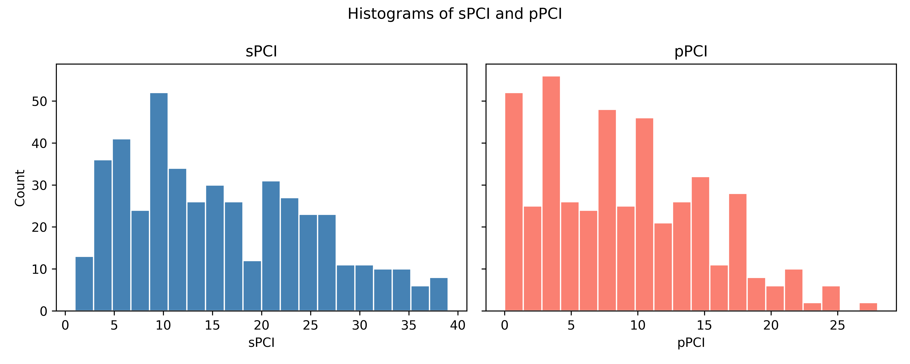
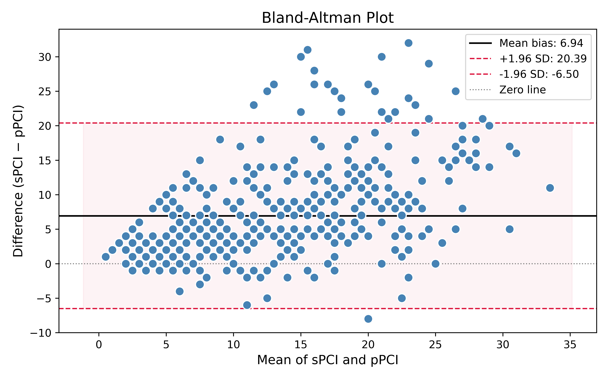
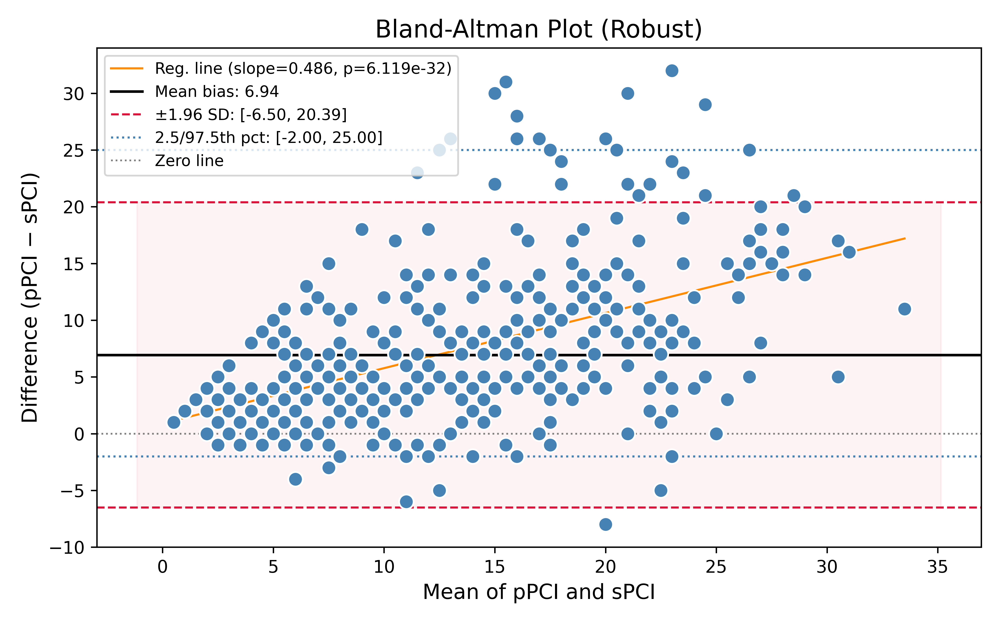

# Agreement Analysis: sPCI vs pPCI

**Date:** April 16, 2026  
**Source:** `notebooks/01-agreement_all.ipynb`

---

## 1. Data Overview

- **Sample size:** n = 454 paired measurements
- Two continuous variables: `sPCI` and `pPCI`

| Statistic | sPCI | pPCI |
|-----------|------|------|
| Mean | 15.872 | 8.930 |
| SD | 9.469 | 6.219 |
| Skewness | 0.504 | 0.494 |

Both distributions are mildly right-skewed. sPCI shows systematically higher values than pPCI.

---

## 2. Systematic Bias

The mean difference (sPCI − pPCI) is **6.943**, and the median difference is **5.0**, indicating a large and consistent positive bias of sPCI over pPCI across all observations.

---

## 3. Hypothesis Tests for Systematic Difference

All tests strongly reject the null hypothesis of no systematic difference:

| Test | Statistic | p-value |
|------|-----------|---------|
| Paired permutation test (mean) | 6.943 | < 0.0001 |
| Paired permutation test (median) | 5.0 | < 0.0001 |
| Sign test | 399 / 429 positive signs | $1.96 \times 10^{-83}$ |

The sign test found 399 out of 429 non-tied pairs where sPCI > pPCI, confirming that the bias is overwhelmingly directional.

---

## 4. Confidence Intervals for the Difference

### Mean difference

| Method | Lower | Upper |
|--------|-------|-------|
| Percentile bootstrap (20,000 resamples) | 6.313 | 7.586 |
| BCa bootstrap | 6.325 | 7.599 |

### Median difference

| Method | Lower | Upper |
|--------|-------|-------|
| Percentile bootstrap | 4.0 | 6.0 |
| BCa bootstrap | 4.0 | 5.0 |

The BCa CIs are narrow and entirely above zero, confirming a robust, non-trivial systematic offset.

---

## 5. Bland-Altman Analysis

### Classical Bland-Altman

| Parameter | Value |
|-----------|-------|
| Mean bias (sPCI − pPCI) | **6.943** |
| SD of differences | 6.861 |
| Upper limit of agreement (+1.96 SD) | **20.39** |
| Lower limit of agreement (−1.96 SD) | **−6.50** |

The limits of agreement span nearly 27 units (−6.5 to 20.4), indicating very wide variability between the two methods beyond the systematic offset.

### Robust Bland-Altman (quantile-based)

| Parameter | Value |
|-----------|-------|
| Median bias | 5.000 |
| Robust LoA (2.5th – 97.5th percentile) | [−2.0, 25.0] |

### Proportional Bias

A significant proportional bias was detected (regression of differences on means):

| Parameter | Value |
|-----------|-------|
| Slope | 0.486 |
| Intercept | 0.913 |
| Pearson r | 0.514 |
| p-value | $6.12 \times 10^{-32}$ |

The positive slope indicates that the discrepancy between sPCI and pPCI **grows as the average value increases** — methods diverge more at higher PCI levels.

---

## 6. Intraclass Correlation (ICC)

Using ICC(A,1) (absolute agreement, single rater):

### Without bias correction

| Model | ICC | 95% CI | p-value |
|-------|-----|--------|---------|
| ICC(A,1) | **0.461** | [−0.0, 0.70] | < 0.0001 |

The ICC of 0.46 reflects only moderate absolute agreement, heavily penalised by the large systematic bias.

### After bias correction (median shift = 5.0 removed from sPCI)

| Model | ICC | 95% CI | p-value |
|-------|-----|--------|---------|
| ICC(A,1) | **0.616** | [0.54, 0.68] | $7.74 \times 10^{-53}$ |

After removing the median bias, ICC improves to 0.62, indicating **moderate-to-good consistency** in the relative ordering of values between methods, but with still substantial residual variability.

---

## 7. Summary and Interpretation

sPCI and pPCI **cannot be considered interchangeable**:

1. **Large systematic bias:** sPCI exceeds pPCI by approximately 5–7 units on average (depending on mean vs median), which is clinically meaningful given the range of 0–40.
2. **Wide limits of agreement:** Even ignoring the bias, differences between methods range from roughly −6.5 to +20.4 (classical) or −2 to +25 (robust), making individual-level substitution unreliable.
3. **Proportional bias:** The disagreement is worse for patients with higher PCI values, which is particularly concerning if the two methods are applied selectively by severity.
4. **Moderate consistency after bias correction:** An ICC of 0.62 suggests the methods track the same underlying construct reasonably well in rank terms, but the fixed and proportional offsets remain a barrier to direct comparison.

**Recommendation:** If both methods are used in the same study, a recalibration or harmonisation step is necessary before combining or directly comparing sPCI and pPCI scores.
